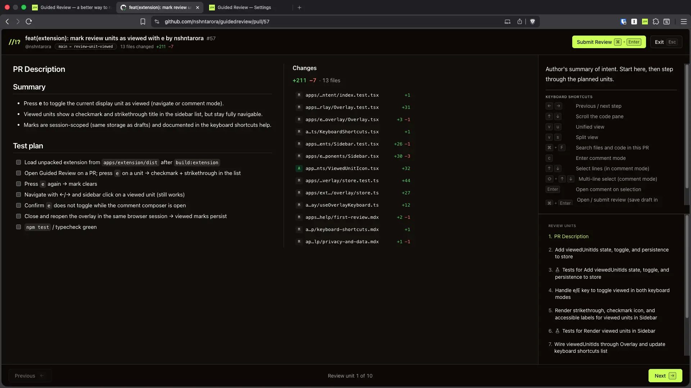

# Guided Review


Review AI-generated code before you sign your name to it. Guided Review turns GitHub pull requests and local git changes into an ordered walkthrough of **review units** so you can read the change with intent instead of reconstructing it from an alphabetical file list.

1. Open a pull request and hit **Start Guided Review**, or run `npx @guided-review/cli` in a repo.
2. When you ask for AI structure, your LLM clusters related hunks and adds short commentary — schema, then logic, then call-sites, then tests.
3. Follow the walkthrough keyboard-first. The code always comes from the real diff; **you still read it and decide**.

Free, open source, bring your own LLM key. Guided Review has no product backend: the extension and CLI talk directly to your AI provider, and the extension talks to GitHub for PRs.

- **Chrome extension** — [Chrome Web Store](https://chromewebstore.google.com/detail/pdnnimoajmnjpccboemeomoeomancodd), or build from source below
- **CLI** — `npx @guided-review/cli` ([npm](https://www.npmjs.com/package/@guided-review/cli))

Site and docs: [guidedreview.dev](https://guidedreview.dev) · [docs](https://guidedreview.dev/docs).

- [Demo](#demo)
- [Why?](#why)
- [Getting Started](#getting-started)
  - [Chrome extension](#chrome-extension)
  - [Local CLI](#local-cli)
  - [Development](#development)
  - [Building](#building)
  - [Testing](#testing)
- [Usage](#usage)
- [Configuration](#configuration)
- [License](#license)

## Demo

Click the image below to play

[](https://guidedreview.dev/product-preview/demo.webm)

## Why?

AI agents are writing a lot of the code landing in your PRs and on your branches. Review agents help find bugs and edge cases you missed — useful — but they are not a replacement for you. They lack taste: product context, people, when an abstraction is unnecessary, when to break the rules.

Nothing beats reading the code. GitHub still hands you every changed file in alphabetical order; a raw `git diff` is no better. That was awkward for human-written diffs; for large AI-shaped changes it is actively hostile.

Guided Review uses AI only where it helps: clustering related hunks into a walkable order and adding short summaries you can take or ignore. It does not auto-approve, and it does not invent the code you see. You still decide.

## Getting Started

### Chrome extension

**From the store:** install from the [Chrome Web Store](https://chromewebstore.google.com/detail/pdnnimoajmnjpccboemeomoeomancodd), open Options → add an LLM API key → open a GitHub PR → **Start Guided Review**.

**From source** — requires **Node.js** ≥ 22, **pnpm** ≥ 11, and **Chrome**:

1. Install dependencies from the monorepo root:

```bash
pnpm install
```

2. Build the extension:

```bash
pnpm build:extension
```

3. Load it in Chrome:
   - Open `chrome://extensions`
   - Enable **Developer mode**
   - **Load unpacked** → select **`apps/extension/dist`** (never a root-level `dist/`)

4. Open Options → add an LLM API key → open a GitHub PR → **Start Guided Review**

### Local CLI

Requires **Node.js** ≥ 22. No clone needed:

```bash
npx @guided-review/cli
```

The CLI starts a local server on `127.0.0.1`, opens a browser UI, and walks the current branch versus its base, uncommitted work, or a single commit. It starts file-by-file and does not call an LLM until you click **Structure With AI**.

```bash
npx @guided-review/cli --base main --no-open
npx @guided-review/cli --staged --agent claude-code
```

The binary is `guidedreview`. Full detail: [CLI](https://guidedreview.dev/docs/cli) · [`apps/cli/README.md`](apps/cli/README.md).

From this repo after `pnpm install`:

```bash
pnpm build:cli
pnpm review
pnpm review -- --base main --no-open
```

### Development

For day-to-day work with HMR:

```bash
pnpm dev                 # extension Vite / crx on port 5173
pnpm dev:cli             # CLI UI + server
pnpm dev:web             # marketing site → http://localhost:3000
```

After extension code changes, rebuild if needed (`pnpm build:extension`), **Reload** the extension card in `chrome://extensions`, and refresh the PR tab. Chrome serves whatever is currently in `dist/` — a running dev server alone does not replace that reload.

More detail: [apps/extension/README.md](apps/extension/README.md) · [apps/cli/README.md](apps/cli/README.md) · [apps/web/README.md](apps/web/README.md).

### Building

```bash
pnpm build:extension     # typecheck + Vite → apps/extension/dist (+ zip)
pnpm build:cli           # CLI binary + UI → apps/cli/dist
pnpm build               # every workspace package with a build script (extension, site, CLI)
pnpm build:web           # Next.js static export → apps/web/out
```

### Testing

From the monorepo root:

```bash
pnpm test                    # unit tests (extension + UI)
pnpm test:e2e:install        # Chromium for extension e2e (once)
pnpm test:e2e                # extension Playwright e2e (builds first)
pnpm test:e2e:web            # marketing site e2e (builds first)
pnpm test:e2e:cli            # CLI Playwright e2e (builds first)
```

Also available: `pnpm typecheck`, `pnpm lint`, `pnpm format`. Workspace-scoped runs use `pnpm --filter @guided-review/<package> <script>`.

## Usage

**On a GitHub pull request** — click **Start Guided Review** (or open from the extension once you are on the PR). The overlay walks you through review units — related hunks grouped and ordered — with keyboard shortcuts for next/prev unit, commenting, and submit.

- Without an API key, you still get a **one unit per file** fallback so navigation and comments work; connect a provider for clustered plans.
- Reading a PR and generating a plan does **not** require GitHub OAuth. Submitting a review (approve / comment / request changes) does — device flow, public client id only.
- Line comments attach to the **real** diff lines shown for a unit, not to model-invented code.

Docs: [Your first review](https://guidedreview.dev/docs/first-review) · [Keyboard shortcuts](https://guidedreview.dev/docs/keyboard-shortcuts) · [Submit a review](https://guidedreview.dev/docs/submit-review).

**On local changes** — run the CLI in a git repo, pick the scope (branch vs base, uncommitted, unstaged, or a commit), then use **Structure With AI** when you want related files grouped into review units with short context. Line notes stay in the running session; there is no GitHub submit. **Generate Prompt** builds a coding-agent prompt from those notes and copies it — Guided Review does not send it anywhere.

Docs: [CLI](https://guidedreview.dev/docs/cli).

## Configuration

**LLM provider** — Anthropic, OpenAI, or Grok, with your own API key.

- **Extension** — Options page; keys live in `chrome.storage.local` on your machine. See [Configure AI provider](https://guidedreview.dev/docs/configure-provider).
- **CLI** — Settings in the local UI, env vars (`ANTHROPIC_API_KEY` / `OPENAI_API_KEY` / `XAI_API_KEY` or `GROK_API_KEY`), `~/.config/guided-review/config.json`, or a coding agent already on the machine (Claude Code, Codex, Grok). See [CLI](https://guidedreview.dev/docs/cli).

**GitHub OAuth (extension, optional)** — needed only to submit reviews from the overlay. Create an OAuth App with **Device Flow** enabled, then at the monorepo root:

```bash
cp .env.example .env        # set VITE_GITHUB_CLIENT_ID
pnpm build:extension
```

Full setup: [apps/extension/README.md — GitHub OAuth](apps/extension/README.md#github-oauth).

**Monorepo** — pnpm workspaces:

| Path                               | What                                            |
| ---------------------------------- | ----------------------------------------------- |
| [`apps/extension`](apps/extension) | Chrome MV3 extension (GitHub PRs)               |
| [`apps/cli`](apps/cli)             | Local git review CLI (`npx @guided-review/cli`) |
| [`apps/web`](apps/web)             | Marketing site and docs (Next.js)               |
| [`packages/core`](packages/core)   | Review engine (parse, cluster, summarise)       |
| [`packages/ui`](packages/ui)       | Shared tokens, brand assets, presentational UI  |

Package READMEs own architecture, deploy, and contribution detail for each.

## License

Licensed under the [Apache License, Version 2.0](LICENSE).
