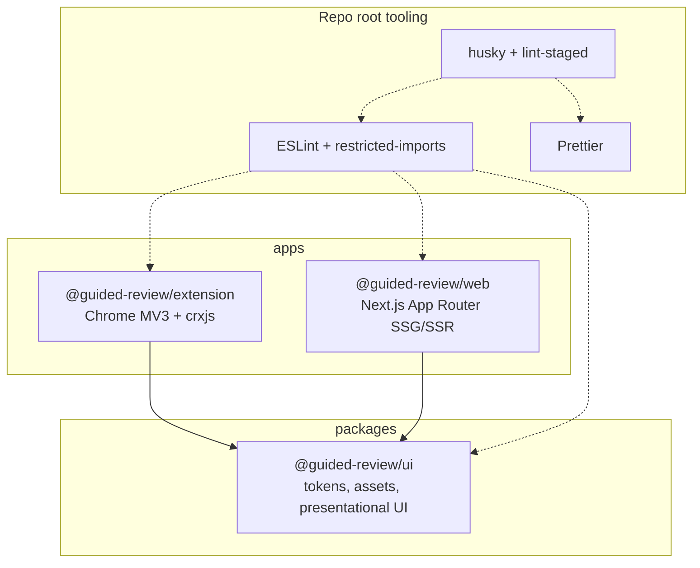
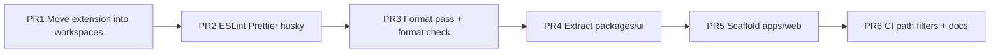

# Monorepo Structure: Extension + Landing Page + Shared UI

| Field       | Value                                                                |
| ----------- | -------------------------------------------------------------------- |
| **Author**  | TBD                                                                  |
| **Date**    | 2026-07-21                                                           |
| **Status**  | Draft (revised: SSR/SSG web app; user answers incorporated)          |
| **Scope**   | Repository layout, packaging, shared UI, root tooling, CI, migration |
| **Related** | Current flat layout at repo root; `AGENTS.md` extension architecture |

---

## Overview

Guided Review is a single-package Chrome MV3 extension (`@crxjs/vite-plugin` + Vite 5 + React 18 + Tailwind v4). We need a **marketing website** in the same git repository while keeping the **extension build and artifacts fully isolated**, and we need a **shared UI package** so brand, tokens, and small presentational components stay consistent across both surfaces.

This document proposes converting the repo into an **npm workspaces monorepo** with:

- `apps/extension` — existing Chrome extension (moved as a unit)
- `apps/web` — **server-generated / server-rendered** marketing site (**Next.js App Router**), not a client-only SPA
- `packages/ui` — shared design tokens, assets, utilities, and presentational components
- **Root-level** ESLint, Prettier, and pre-commit hooks (new; none exist today)

Builds remain independent: `apps/extension` still emits a loadable Chrome package under `apps/extension/dist/`; `apps/web` emits a Next.js build (`.next/` and, if using static export, `out/`). Shared code is consumed as a workspace package (`@guided-review/ui`) via source exports (no separate publish step).

---

## Background & Motivation

### Current state

The repository is flat:

```
guidedreview/
  package.json          # name: "guided-review", version 0.1.0
  vite.config.ts        # crx + react + tailwind, outDir: dist, port 5173, emptyOutDir: true
  manifest.config.ts    # icons under public/icons/*; web_accessible_resources: logomark.svg
  src/
    background/         # service worker + LLM providers
    content/            # content script + overlay (uses logomark.svg, Spinner, Kbd)
    options/            # settings page (BrandHeader → icon.png, ProviderIcon, Select)
    popup/              # action popup (logomark.svg via chrome.runtime.getURL)
    lib/                # cn, github, review, settings, types, messaging
    styles/theme.css    # Tailwind v4 @theme + :root opt-* + reduced-motion *
    test/               # chrome mock, vitest setup
  public/
    icon.{png,svg} logo.{png,svg} logomark.{png,svg}
    icons/icon{16,48,128}.png   # generated by scripts/gen-icons.py from icon.png
    providers/{claude,grok,openai}.svg
  e2e/                  # Playwright; fixtures load ../dist
  scripts/gen-icons.py  # ROOT = scripts/.. → public/icon.png → public/icons/*
  dist/                 # unpacked extension (Chrome load path today)
  .github/workflows/tests.yml   # Node 22, npm ci, typecheck, unit, e2e
```

Notable facts for the redesign:

| Concern              | Current reality                                                                                                                         |
| -------------------- | --------------------------------------------------------------------------------------------------------------------------------------- |
| Package manager      | npm + `package-lock.json`; CI uses `npm ci` (Node 22) in `.github/workflows/tests.yml`                                                  |
| Shared styles        | `src/styles/theme.css` — Tailwind v4 `@theme` tokens; imported by options (`main.tsx`) and overlay (`overlay.css`)                      |
| Class helper         | `src/lib/cn.ts` (`clsx`); **relative** imports only (`../lib/cn`, `../../lib/cn`, `../../../lib/cn`) — not `@/lib/cn`                   |
| Brand / UI fragments | `BrandHeader` (options), `Spinner` (overlay), `ActionSpinner` (options), `Kbd` (overlay), `ProviderIcon` + `Select` (options)           |
| Brand assets         | PNG+SVG for icon/logo/logomark; sized icons; providers; consumers include options, popup, content button, ProgressHeader, manifest, WAR |
| Chrome coupling      | `BrandHeader` and `ProviderIcon` call `chrome.runtime.getURL(...)`; popup/content/ProgressHeader use `logomark.svg`                     |
| Lint/format hooks    | **None** — no ESLint, Prettier, husky, or lint-staged                                                                                   |
| Docs for agents      | `AGENTS.md` documents root scripts (`npm run build` → `dist/`)                                                                          |
| Overlay CSS          | `overlay.css?inline` into Shadow DOM; deliberate `@layer reset, theme, …` with host `all: initial` before theme import                  |

### Pain points

1. **No place for a marketing site** without either polluting the extension build or forking the repo.
2. **Brand/token drift risk** once the landing page is built with a second copy of logos and colors.
3. **Tooling gap** — introducing ESLint/Prettier/hooks ad hoc inside the extension package would make a second app inconsistent.
4. **`dist/` overload** — a single `dist/` is the Chrome load path; a web deploy target must never share or overwrite it.

### Why monorepo (not two repos)

- Shared brand and components evolve with the product.
- One CI, one PR for cross-cutting design changes.
- Single source of truth for versioning narrative (extension version can remain the product version; web is unversioned marketing surface).

---

## Goals & Non-Goals

### Goals

1. **Separate apps** for extension and marketing site with independent `dev` / `build` / `preview` (or `start`) scripts.
2. **Isolated build outputs** — extension `dist/` never mixed with web Next output; Chrome workflow unchanged in spirit (`build` → load unpacked). Root `npm run build` continues to mean “build the extension” until web exists, then becomes a dual build (see scripts).
3. **Shared package** for tokens, assets, and presentational UI both apps can import.
4. **Root-owned** ESLint, Prettier, husky + lint-staged.
5. **Incremental migration** that keeps extension unit + e2e green at each mergeable PR.
6. Preserve three extension runtime contexts and messaging boundaries described in `AGENTS.md`.
7. **Server-generated (preferred) or server-rendered HTML** for marketing pages — SEO-friendly first paint, no client-only SPA shell as the primary delivery model.
8. **Multi-route site:** landing (`/`), privacy (`/privacy`), terms (`/terms`) at minimum.

### Non-Goals

1. Publishing packages to npm (workspace-local only).
2. Sharing extension-only logic (diff parser, review plan, providers, chrome messaging, overlay store, GitHub OAuth).
3. Introducing Turborepo/Nx in the first cut (revisit if CI or local orchestration becomes painful).
4. Migrating package managers away from npm (pnpm/yarn optional later; not required).
5. Changing extension product architecture (MV3 contexts, streaming annotate pipeline, session keys).
6. Full design-system documentation site or Storybook (optional follow-up).
7. Client-only Vite SPA for the marketing site (explicitly rejected in favor of SSG/SSR).
8. Choosing production host in this design (hosting deferred — Next output remains host-agnostic).

---

## Key Decisions

| #   | Decision                                                                                                                                                                                                                                                                      | Rationale                                                                                                                                                                                                                                                                          |
| --- | ----------------------------------------------------------------------------------------------------------------------------------------------------------------------------------------------------------------------------------------------------------------------------- | ---------------------------------------------------------------------------------------------------------------------------------------------------------------------------------------------------------------------------------------------------------------------------------- |
| 1   | **npm workspaces** (not pnpm/yarn)                                                                                                                                                                                                                                            | Existing lockfile + `npm ci` CI; 3 packages is well within npm workspaces capability; avoids team-wide manager switch.                                                                                                                                                             |
| 2   | **No Turbo/Nx initially**                                                                                                                                                                                                                                                     | Two apps + one lib; root scripts with `npm run -w` / `npm run --workspaces` suffice. Add Turbo later only for caching/path-filtered CI if needed.                                                                                                                                  |
| 3   | **`apps/*` + `packages/*` layout**                                                                                                                                                                                                                                            | Conventional, clear boundary between deployable apps and libraries.                                                                                                                                                                                                                |
| 4   | **One shared package: `@guided-review/ui`**                                                                                                                                                                                                                                   | Avoid over-splitting (`ui` vs `tokens` vs `assets`) until real need; tokens/assets/components ship together.                                                                                                                                                                       |
| 5   | **Source exports (no prebuild / no emit of `packages/ui`)**                                                                                                                                                                                                                   | Extension (Vite) and web (Next) both transpile TS/TSX from the package via workspace symlink + `exports` → `./src/...`. Next requires `transpilePackages: ["@guided-review/ui"]`. Ui package has **`typecheck` only** (no `build` script).                                         |
| 6   | **Extension stays on `@/` alias → local `src/`**; shared imports use package name                                                                                                                                                                                             | Keeps existing extension imports stable; only extracted modules change import paths.                                                                                                                                                                                               |
| 7   | **Asset URLs injected by host** (`iconSrc` prop, not `chrome.runtime.getURL` inside shared UI)                                                                                                                                                                                | Shared package must not depend on Chrome APIs. Next can pass static imports or `public/` URLs.                                                                                                                                                                                     |
| 8   | **Root ESLint flat config + Prettier + husky/lint-staged**                                                                                                                                                                                                                    | Single policy; packages inherit root config. Next ESLint plugin optional in `apps/web` or root flat config override.                                                                                                                                                               |
| 9   | **Extension `dist` remains under `apps/extension/dist`**                                                                                                                                                                                                                      | e2e and Chrome load path stay package-local; document new load path; developers must drop any old root-`dist/` load.                                                                                                                                                               |
| 10  | **Web app: Next.js App Router + React + Tailwind v4; SSG by default**                                                                                                                                                                                                         | Marketing pages are **server-generated** at build time (static HTML + streaming where useful). SSR remains available for future dynamic routes. Better SEO, meta tags, and multi-route structure than a Vite SPA.                                                                  |
| 11  | **Do not put `ProviderId` / provider catalog in `ui`**                                                                                                                                                                                                                        | Catalog is product config tied to background clients; web can hardcode marketing copy or a slim static list later.                                                                                                                                                                 |
| 12  | **Staged PR order (canonical):** **(1) move extension into workspaces** → **(2) root ESLint/Prettier/husky** → **(3) format pass + enable `format:check`** → **(4) extract `@guided-review/ui`** → **(5) scaffold `apps/web` (Next)** → **(6) CI path filters + docs polish** | Single ordered list matching the PR Plan.                                                                                                                                                                                                                                          |
| 13  | **Tailwind `@source` is required** for every app that builds CSS consuming `packages/ui` components                                                                                                                                                                           | Tailwind v4 scans filesystem sources and **ignores `node_modules` / gitignored paths**; workspace packages resolve through `node_modules/@guided-review/ui` and sit outside each app’s tree.                                                                                       |
| 14  | **ESLint `no-restricted-imports` is required**                                                                                                                                                                                                                                | Web ↛ extension; ui ↛ chrome/extension. Lands with lint (PR 2) / web (PR 5), not as optional polish.                                                                                                                                                                               |
| 15  | **Shared UI is RSC-safe by default; mark interactive pieces `"use client"`**                                                                                                                                                                                                  | Next App Router renders Server Components by default. Pure presentational components (`BrandMark`, `Spinner`, `Kbd`, `cn`) stay free of browser-only APIs so they work in RSC and in the extension. Any future interactive shared widget gets an explicit `"use client"` boundary. |
| 16  | **Sized brand icons committed in `packages/ui`**                                                                                                                                                                                                                              | `icon{16,48,128}.png` live under ui assets and sync into extension `public/icons/`. `gen-icons.py` is a maintainer tool only — not a CI dependency.                                                                                                                                |
| 17  | **Hosting deferred**                                                                                                                                                                                                                                                          | Scaffold and CI `next build` only; wire Cloudflare/Vercel/etc. when ready. Prefer keeping SSG so either static export or Node host works.                                                                                                                                          |

---

## Proposed Design

### Target tree

```
guidedreview/                          # git root
├── package.json                       # workspaces root; orchestrates scripts
├── package-lock.json                  # single lockfile
├── .npmrc                             # optional: engine-strict, etc.
├── .gitignore                         # dist/, apps/*/dist, test artifacts (see below)
├── .editorconfig                      # optional
├── .prettierrc / .prettierignore
├── eslint.config.js                   # flat config (ESLint 9) + restricted-imports
├── .husky/
│   └── pre-commit                     # lint-staged
├── lint-staged.config.js
├── tsconfig.base.json                 # shared compilerOptions (noEmit; no composite in v1)
├── AGENTS.md                          # update paths/scripts
├── README.md
├── .github/workflows/
│   └── tests.yml                      # replace/extend existing tests.yml (or rename to ci.yml in same PR)
│
├── apps/
│   ├── extension/                     # Chrome MV3 extension (current product)
│   │   ├── package.json               # name: @guided-review/extension, version 0.1.0
│   │   ├── vite.config.ts             # outDir dist, emptyOutDir true, port 5173 strict
│   │   ├── vitest.config.ts
│   │   ├── playwright.config.ts       # testDir ./e2e; run with package cwd via -w
│   │   ├── manifest.config.ts
│   │   ├── tsconfig.json
│   │   ├── tsconfig.test.json
│   │   ├── public/                    # MV3 packaged static files (synced brand + providers)
│   │   ├── e2e/
│   │   ├── scripts/
│   │   │   ├── gen-icons.py           # ROOT = apps/extension; reads public/icon.png
│   │   │   └── sync-ui-assets.mjs     # copies brand assets from packages/ui (PR 4)
│   │   ├── src/
│   │   │   ├── background/
│   │   │   ├── content/
│   │   │   ├── options/
│   │   │   ├── popup/
│   │   │   ├── lib/                   # extension-only (github, review, types, …)
│   │   │   └── test/
│   │   └── dist/                      # Chrome load path (gitignored)
│   │
│   └── web/                           # Marketing site (Next.js App Router)
│       ├── package.json               # name: @guided-review/web
│       ├── next.config.ts             # transpilePackages: [@guided-review/ui]
│       ├── tsconfig.json
│       ├── postcss.config.mjs         # if required by Tailwind v4 + Next
│       ├── public/                    # favicon, OG images, static only
│       ├── app/                       # App Router
│       │   ├── layout.tsx             # root layout; import globals.css
│       │   ├── page.tsx               # landing (SSG by default)
│       │   ├── privacy/page.tsx
│       │   ├── terms/page.tsx
│       │   └── globals.css            # @source ui + @import theme
│       ├── components/                # web-only page sections (Hero, Footer, …)
│       ├── .next/                     # Next build output (gitignored)
│       └── out/                       # only if using `output: 'export'` (gitignored)
│
└── packages/
    └── ui/
        ├── package.json               # @guided-review/ui — typecheck only, no build emit
        ├── tsconfig.json
        ├── vitest.config.ts           # minimal unit tests for cn / Spinner / Kbd
        ├── src/
        │   ├── index.ts
        │   ├── cn.ts
        │   ├── cn.test.ts
        │   ├── components/
        │   │   ├── Spinner.tsx
        │   │   ├── Spinner.test.tsx
        │   │   ├── Kbd.tsx
        │   │   ├── Kbd.test.tsx
        │   │   └── BrandMark.tsx
        │   ├── styles/
        │   │   └── theme.css          # full file moved (tokens + :root opt-* + reduced-motion)
        │   └── assets/                # canonical brand sources (all formats used)
        │       ├── icon.png
        │       ├── icon.svg
        │       ├── logo.png
        │       ├── logo.svg
        │       ├── logomark.png
        │       ├── logomark.svg
        │       └── icons/             # committed sized icons (canonical; sync to extension)
        │           ├── icon16.png
        │           ├── icon48.png
        │           └── icon128.png
        └── README.md
```

### Package graph



### Workspace root `package.json` (canonical)

**Post-migration (after web lands):**

```json
{
  "name": "guided-review-monorepo",
  "private": true,
  "workspaces": ["apps/*", "packages/*"],
  "scripts": {
    "dev": "npm run dev -w @guided-review/extension",
    "dev:extension": "npm run dev -w @guided-review/extension",
    "dev:web": "npm run dev -w @guided-review/web",
    "build": "npm run build:extension && npm run build:web",
    "build:extension": "npm run build -w @guided-review/extension",
    "build:web": "npm run build -w @guided-review/web",
    "start:web": "npm run start -w @guided-review/web",
    "typecheck": "npm run typecheck --workspaces --if-present",
    "test": "npm run test -w @guided-review/extension && npm run test -w @guided-review/ui --if-present",
    "test:e2e": "npm run test:e2e -w @guided-review/extension",
    "lint": "eslint .",
    "lint:fix": "eslint . --fix",
    "format": "prettier --write .",
    "format:check": "prettier --check .",
    "prepare": "husky"
  },
  "devDependencies": {
    "eslint": "^9.x",
    "typescript-eslint": "^8.x",
    "eslint-plugin-react-hooks": "...",
    "eslint-config-prettier": "...",
    "prettier": "^3.x",
    "husky": "^9.x",
    "lint-staged": "^15.x",
    "typescript": "^5.6.3"
  },
  "engines": {
    "node": ">=22"
  }
}
```

**Mid-migration (after PR 1 / move, before web):**

```json
{
  "scripts": {
    "dev": "npm run dev -w @guided-review/extension",
    "build": "npm run build -w @guided-review/extension",
    "build:extension": "npm run build -w @guided-review/extension",
    "typecheck": "npm run typecheck --workspaces --if-present",
    "test": "npm run test -w @guided-review/extension",
    "test:e2e": "npm run test:e2e -w @guided-review/extension"
  }
}
```

Notes:

- **Authoritative root `build`:** `build:extension && build:web` once web exists; **extension-only** until then. Muscle memory: root `npm run build` still builds the extension (and web when present). There is **no** `npm run build -w @guided-review/ui` — ui has no emit step.
- Root holds **tooling** deps only. Runtime deps live in the packages that need them. React is a **peerDependency** of `@guided-review/ui` and a **dependency** of both apps.
- `dev` aliases to extension so day-to-day extension work matches old habits.

### Extension package (`apps/extension`)

**Move almost everything** that is extension-specific as a unit:

| From (today)                                                                       | To                                                                                                   |
| ---------------------------------------------------------------------------------- | ---------------------------------------------------------------------------------------------------- |
| `src/**`                                                                           | `apps/extension/src/**` (minus extracted UI pieces in PR 4)                                          |
| `public/**`                                                                        | `apps/extension/public/**`                                                                           |
| `e2e/**`                                                                           | `apps/extension/e2e/**`                                                                              |
| `manifest.config.ts`, `vite.config.ts`, `vitest.config.ts`, `playwright.config.ts` | `apps/extension/`                                                                                    |
| `scripts/`                                                                         | `apps/extension/scripts/` (update `gen-icons.py` ROOT; remains valid as `scripts/..` = package root) |

**Scripts** (package-local; names preserved for familiarity):

```json
{
  "name": "@guided-review/extension",
  "private": true,
  "version": "0.1.0",
  "type": "module",
  "scripts": {
    "predev": "node scripts/sync-ui-assets.mjs",
    "dev": "vite",
    "prebuild": "node scripts/sync-ui-assets.mjs",
    "build": "tsc -b && vite build",
    "typecheck": "tsc -b --noEmit",
    "test": "vitest run",
    "test:watch": "vitest",
    "test:coverage": "vitest run --coverage",
    "pretest:e2e": "npm run build",
    "test:e2e": "playwright test",
    "test:e2e:ui": "playwright test --ui",
    "test:e2e:install": "playwright install --with-deps chromium",
    "gen-icons": "python3 scripts/gen-icons.py"
  },
  "dependencies": {
    "@guided-review/ui": "*",
    "react": "...",
    "react-dom": "...",
    "zustand": "...",
    "dompurify": "...",
    "highlight.js": "...",
    "highlightjs-zig": "..."
  }
}
```

Notes on deps:

- **`clsx` is not an extension direct dependency after PR 4.** Today it is only used via `src/lib/cn.ts`. Once `cn` lives in `@guided-review/ui`, the extension consumes `clsx` transitively through ui. Keep `clsx` on the extension package **until PR 4** (while `lib/cn.ts` still exists); drop it from extension `dependencies` in the extract PR.
- (`predev`/`prebuild` sync scripts land in **PR 4** when ui assets exist; until then omit them.)

**Vite config** (relative to today at root `vite.config.ts`):

- Keep `@` → `./src` inside the extension package.
- If dual React instances appear, set `resolve.dedupe: ["react", "react-dom"]`.
- `build.outDir: "dist"` stays **package-relative** → `apps/extension/dist` only.
- Keep **`emptyOutDir: true`** package-scoped (must never clear another package’s output).
- Port **5173** + `strictPort: true` remains for crx HMR (do not share with web).
- `manifest.config.ts` continues to import version from **local** `package.json`.

**e2e** (`e2e/fixtures.ts` today):

```ts
const EXTENSION_PATH = path.resolve(__dirname, "../dist");
```

After move this remains correct **if** e2e lives under `apps/extension/e2e` (still `../dist`). Do **not** lift e2e to root.

**Playwright / Vitest cwd:** `npm run test -w @guided-review/extension` and `npm run test:e2e -w @guided-review/extension` run with package root as cwd, so `playwright.config.ts` `testDir: "./e2e"` and vitest `include: ["src/**/*.test.{ts,tsx}"]` keep working without path rewrites.

**Chrome load path for developers (breaking path change):**

```
Load unpacked → …/guidedreview/apps/extension/dist
```

**Important:** After PR 1, any Chrome “Load unpacked” still pointed at the **old root** `guidedreview/dist/` is stale. Remove that entry and load `apps/extension/dist` instead. Delete leftover root `dist/` if present so it is not reloaded by habit.

Update `AGENTS.md` and README with bold callouts. Habit: `npm run build` (root proxy) or `npm run build:extension` before reloading the extension.

### Marketing site (`apps/web`) — Next.js (SSG/SSR)

Greenfield **Next.js App Router** app with React 18/19 and Tailwind v4. The site is **not** a client-only SPA: HTML is **server-generated at build time (SSG)** for marketing routes by default, with full **SSR** available if a future page needs request-time data.

| Item      | Choice                                                                                                 |
| --------- | ------------------------------------------------------------------------------------------------------ |
| Framework | **Next.js App Router** (React)                                                                         |
| Rendering | **SSG default** for `/`, `/privacy`, `/terms` (static at `next build`); SSR optional per-route later   |
| Styling   | Tailwind v4 via CSS entry (`app/globals.css`) + `@source` of `packages/ui`                             |
| Dev port  | **3000** (Next default) — extension stays on **5173**; no port conflict                                |
| Output    | `.next/` (Node/server or platform adapter); optional `output: 'export'` → `out/` for pure static hosts |
| Routing   | File-based App Router: `app/page.tsx`, `app/privacy/page.tsx`, `app/terms/page.tsx`                    |
| Content   | Landing (hero, value prop, install CTA), privacy, terms                                                |
| Shared UI | `@guided-review/ui` via `transpilePackages`                                                            |
| Hosting   | **Deferred** — CI only runs `next build`; deploy wiring later                                          |

**Does not depend on** `@crxjs/vite-plugin`, `chrome` types, or extension `src/lib/*` (enforced by ESLint restricted imports).

#### Why Next.js (vs TanStack Start / others)

| Option                             | Pros                                                                                                                                                | Cons                                                                           | Verdict                                           |
| ---------------------------------- | --------------------------------------------------------------------------------------------------------------------------------------------------- | ------------------------------------------------------------------------------ | ------------------------------------------------- |
| **Next.js App Router**             | Mature SSG/SSR, first-class metadata/SEO APIs, huge hosting support (Vercel, Cloudflare, Node), monorepo `transpilePackages`, App Router multi-page | Heavier than a SPA; React version may track Next’s peer range                  | **Recommended for v1**                            |
| **TanStack Start**                 | Modern Vite-based full-stack React, strong type-safe routing                                                                                        | Younger ecosystem; fewer “drop-in” static hosts; more DIY for SEO defaults     | Revisit if team prefers TanStack stack end-to-end |
| **Remix / React Router framework** | Excellent SSR                                                                                                                                       | Marketing-site SSG story less “batteries included” than Next metadata + static | Viable alternative; not default                   |
| **Astro + React islands**          | Best-in-class static marketing                                                                                                                      | Dual mental model (Astro + React); shared components may need more adaptation  | Good if site stays mostly static HTML             |
| **Vite SPA**                       | Simple                                                                                                                                              | Client-only shell; weaker SEO/first paint without extra work                   | **Rejected** by product requirement               |

#### Rendering mode guidance

```
Marketing routes (/, /privacy, /terms)
  → static generation at build time (default Server Components, no dynamic APIs)
  → full HTML in the first response / CDN object

Future dynamic routes (e.g. personalized install status)
  → opt into SSR or dynamic = 'force-dynamic' only where needed
```

**Default deploy posture:** keep pages static so either:

1. **Platform Node host** (`next start` or adapter) consuming `.next/`, or
2. **Static export** (`output: 'export'` → `out/`) if the chosen host is pure static.

Do **not** lock `output: 'export'` in the scaffold until hosting is chosen — some hosts prefer the full Next build. Scaffold with normal `next build`; document the export flip as a one-line config change when hosting is decided.

#### `next.config.ts` sketch

```ts
import type { NextConfig } from "next";

const nextConfig: NextConfig = {
  // Required for workspace source package (TS/TSX under packages/ui)
  transpilePackages: ["@guided-review/ui"],
  // Uncomment only when hosting is pure-static and no Next server features are needed:
  // output: "export",
  // images: { unoptimized: true }, // often required with static export
};

export default nextConfig;
```

#### App structure (v1 routes)

```
app/
  layout.tsx          # <html>, fonts, BrandMark chrome shell, nav links
  page.tsx            # Landing
  privacy/page.tsx
  terms/page.tsx
  globals.css         # @source + theme
components/           # web-only: Hero, FeatureGrid, Footer, InstallCta
```

Use Next `Metadata` API in each `page.tsx` / `layout.tsx` for title, description, Open Graph — a primary benefit of SSG/SSR over a SPA.

#### Shared UI + React Server Components

| Concern                                                | Rule                                                                                                                                                                                                     |
| ------------------------------------------------------ | -------------------------------------------------------------------------------------------------------------------------------------------------------------------------------------------------------- |
| `cn`, token classes, pure markup components            | Keep **without** `"use client"` so they run as Server Components on web and as normal components in the extension                                                                                        |
| `useState` / `useEffect` / browser APIs in shared code | Not in v1 shared set; if added later, file must start with `"use client"`                                                                                                                                |
| Assets                                                 | Prefer `import icon from "@guided-review/ui/assets/icon.png"` or copy marketing art into `apps/web/public/` for OG images                                                                                |
| Extension                                              | Unchanged: still Vite + client React; `"use client"` directives are ignored/harmless if present but **prefer keeping shared files free of the directive** so extension does not depend on Next semantics |

#### Scripts (`apps/web/package.json`)

```json
{
  "name": "@guided-review/web",
  "private": true,
  "scripts": {
    "dev": "next dev --port 3000",
    "build": "next build",
    "start": "next start --port 3000",
    "typecheck": "tsc -p tsconfig.json --noEmit"
  },
  "dependencies": {
    "@guided-review/ui": "*",
    "next": "^15.x",
    "react": "^18.3.1",
    "react-dom": "^18.3.1"
  }
}
```

Align `react` / `react-dom` major versions with the extension workspace where practical (Next may require a specific range — pin both apps to the intersection).

### Shared package (`packages/ui`)

#### What belongs here

| Item                            | Source today                                                     | Notes                                                                                                                                  |
| ------------------------------- | ---------------------------------------------------------------- | -------------------------------------------------------------------------------------------------------------------------------------- |
| `cn()`                          | `src/lib/cn.ts`                                                  | Pure util; move + unit test                                                                                                            |
| `theme.css` (full file)         | `src/styles/theme.css`                                           | `@theme` tokens **and** `:root` opt-_ light/dark **and** global reduced-motion `_` rule — shipped whole in v1 (see Theme side effects) |
| Brand assets (all used formats) | `public/icon*`, `logo*`, `logomark*`, optionally sized `icons/*` | Canonical sources for sync into extension `public/`                                                                                    |
| `Spinner`                       | overlay spinner                                                  | Token classes `gr-*` only; no chrome                                                                                                   |
| `Kbd`                           | overlay `Kbd.tsx`                                                | Presentational                                                                                                                         |
| `BrandMark`                     | derived from options `BrandHeader`                               | **`iconSrc: string` required** — no `chrome.runtime.getURL`                                                                            |

#### What stays extension-only

| Item                                                                                     | Why                                                                             |
| ---------------------------------------------------------------------------------------- | ------------------------------------------------------------------------------- |
| `ActionSpinner`                                                                          | Uses `opt-*` tokens and options button semantics; extract later if web needs it |
| `Select`                                                                                 | Complex a11y widget; no web need yet                                            |
| `ProviderIcon`                                                                           | Coupled to `ProviderId` + `getProvider` catalog + chrome URL resolution         |
| Diff/overlay components, store, github/_, review/_, messaging, background                | Product logic                                                                   |
| `public/providers/*`                                                                     | Extension options-only SVGs                                                     |
| Overlay residual SCSS/CSS (`_highlight`, `_markdown`, host reset, `@property` fallbacks) | Shadow DOM / GitHub-specific                                                    |

#### Package API

```json
// packages/ui/package.json
{
  "name": "@guided-review/ui",
  "private": true,
  "version": "0.0.0",
  "type": "module",
  "sideEffects": ["**/*.css"],
  "exports": {
    ".": "./src/index.ts",
    "./theme.css": "./src/styles/theme.css",
    "./assets/*": "./src/assets/*"
  },
  "peerDependencies": {
    "react": "^18.3.0",
    "react-dom": "^18.3.0"
  },
  "dependencies": {
    "clsx": "^2.1.1"
  },
  "devDependencies": {
    "@types/react": "^18.3.12",
    "@types/react-dom": "^18.3.1",
    "@vitejs/plugin-react": "^4.3.3",
    "@testing-library/react": "...",
    "@testing-library/jest-dom": "...",
    "jsdom": "...",
    "react": "^18.3.1",
    "react-dom": "^18.3.1",
    "typescript": "^5.6.3",
    "vitest": "..."
  },
  "scripts": {
    "typecheck": "tsc -p tsconfig.json --noEmit",
    "test": "vitest run"
  }
}
```

**No `build` script.** Source exports only; root `typecheck` / `test` cover ui.

**Vitest for React components in `packages/ui`:** peerDependencies alone can be fragile under npm hoist when running `vitest` in this workspace. List `react` / `react-dom` as **devDependencies** of ui (in addition to peers) so the test runner always resolves them. Mirror the extension lightly:

```ts
// packages/ui/vitest.config.ts
import { defineConfig } from "vitest/config";
import react from "@vitejs/plugin-react";

export default defineConfig({
  plugins: [react()],
  test: {
    environment: "jsdom",
    globals: true,
    include: ["src/**/*.test.{ts,tsx}"],
  },
});
```

Barrel:

```ts
// packages/ui/src/index.ts
export { cn } from "./cn";
export { Spinner } from "./components/Spinner";
export { Kbd } from "./components/Kbd";
export { BrandMark } from "./components/BrandMark";
export type { BrandMarkProps } from "./components/BrandMark";
```

Chrome-free `BrandMark`:

```tsx
// packages/ui/src/components/BrandMark.tsx
import { cn } from "../cn";

export interface BrandMarkProps {
  title?: string;
  /** Resolved URL or imported asset URL for the product icon. */
  iconSrc: string;
  className?: string;
}

export function BrandMark({ title = "Guided Review", iconSrc, className }: BrandMarkProps) {
  return (
    <div className={cn("mb-2 flex items-center gap-3", className)}>
      
      <h1 className="m-0 text-lg font-bold">{title}</h1>
    </div>
  );
}
```

**Extension adapter** (thin wrapper, stays in options — not a long-term dual API for other components):

```tsx
// apps/extension/src/options/BrandHeader.tsx
import { BrandMark } from "@guided-review/ui";

export function BrandHeader({ title }: { title?: string }) {
  return <BrandMark title={title} iconSrc={chrome.runtime.getURL("icon.png")} />;
}
```

Prefer **direct package imports** for Spinner/Kbd/cn (no permanent re-export shims). Gradual re-exports only if a single PR becomes too large—delete them before merge or in the immediate follow-up.

Web usage:

```tsx
import { BrandMark } from "@guided-review/ui";
import iconUrl from "@guided-review/ui/assets/icon.png";

<BrandMark iconSrc={iconUrl} />;
```

#### Assets strategy (complete)

Chrome/MV3 **must** ship static files under the extension package (Vite `public/` → build root). JS-importing assets from `@guided-review/ui` is fine for the web app, but **not sufficient** for:

| Consumer                              | Path / resource                                              |
| ------------------------------------- | ------------------------------------------------------------ |
| `manifest.config.ts` icons            | `public/icons/icon16.png`, `icon48.png`, `icon128.png`       |
| `BrandHeader` / `BrandMark` adapter   | `chrome.runtime.getURL("icon.png")`                          |
| Popup, content button, ProgressHeader | `chrome.runtime.getURL("logomark.svg")`                      |
| `web_accessible_resources`            | `["logomark.svg"]` (must exist at extension root in package) |
| CWS / toolbar                         | sized icons from manifest                                    |

**Canonical store (PR 4):** `packages/ui/src/assets/` holds all brand formats actually used today:

- `icon.png`, `icon.svg`
- `logo.png`, `logo.svg`
- `logomark.png`, `logomark.svg`
- **Commit** `icons/icon{16,48,128}.png` under `packages/ui/src/assets/icons/` (user decision: canonical sized icons in ui; no CI ImageMagick).

**Extension sync (PR 4):** `apps/extension/scripts/sync-ui-assets.mjs` run from `prebuild` and `predev`:

```
packages/ui/src/assets/icon.png      → apps/extension/public/icon.png
packages/ui/src/assets/icon.svg      → apps/extension/public/icon.svg
packages/ui/src/assets/logo.*        → apps/extension/public/logo.*
packages/ui/src/assets/logomark.*    → apps/extension/public/logomark.*
packages/ui/src/assets/icons/*       → apps/extension/public/icons/*
```

**`gen-icons.py`:** Maintainer tool only when brand art changes (regenerate sized icons into `packages/ui`, then re-sync). After the move, `ROOT` still resolves to the extension package if the script stays package-local — or point it at `packages/ui` assets. **Not run in CI.**

**Extension-only (never sync from ui):** `public/providers/*`.

**Web:** import via package exports or copy marketing-only art into `apps/web/public/`.

### TypeScript project layout

```
tsconfig.base.json          # shared strict options
apps/extension/tsconfig.json
apps/extension/tsconfig.test.json
apps/web/tsconfig.json
packages/ui/tsconfig.json
```

**v1 policy:** Independent `noEmit` typecheck **per package**. **No** TypeScript project references / `composite` required. Optional references later for IDE only.

**`tsconfig.base.json` sketch** (aligned with current root `tsconfig.json`):

```json
{
  "compilerOptions": {
    "target": "ES2022",
    "useDefineForClassFields": true,
    "lib": ["ES2022", "DOM", "DOM.Iterable"],
    "module": "ESNext",
    "skipLibCheck": true,

    "moduleResolution": "bundler",
    "allowImportingTsExtensions": true,
    "resolveJsonModule": true,
    "isolatedModules": true,
    "noEmit": true,
    "jsx": "react-jsx",

    "strict": true,
    "noUnusedLocals": true,
    "noUnusedParameters": true,
    "noFallthroughCasesInSwitch": true
  }
}
```

**Extension package** preserves chrome/vite types and path alias (from current config):

```json
// apps/extension/tsconfig.json
{
  "extends": "../../tsconfig.base.json",
  "compilerOptions": {
    "baseUrl": ".",
    "paths": { "@/*": ["src/*"] },
    "types": ["chrome", "vite/client"]
  },
  "include": ["src"],
  "exclude": ["src/**/*.test.ts", "src/**/*.test.tsx", "src/test/**"]
}
```

**`tsconfig.test.json`** (extension) continues to extend the package tsconfig and add vitest / testing-library types; include tests + `src/test/**` + optionally keep e2e out of tsc if preferred (current includes `e2e/**`).

**`packages/ui/tsconfig.json`:** extends base; **no** `@types/chrome`; include `src`.

**`apps/web/tsconfig.json`:** extends base; Next.js defaults (`next` plugin / `"jsx": "preserve"` as required by Next); no chrome; no vite client types.

**Path aliases:**

| Package   | Alias               | Maps to                                                            |
| --------- | ------------------- | ------------------------------------------------------------------ |
| extension | `@/*`               | `apps/extension/src/*`                                             |
| web       | `@/*`               | `apps/web/src/*`                                                   |
| all apps  | `@guided-review/ui` | workspace package via Node resolution (npm link in `node_modules`) |

### Tailwind tokens across apps

#### Current imports

- Options: `import "../styles/theme.css"` in `src/options/main.tsx`
- Overlay: `@import "../../../styles/theme.css"` inside `overlay.css` (loaded as `overlay.css?inline` into Shadow DOM)

#### Theme file side effects (v1 intentional)

The full `theme.css` is **not** tokens-only. It also includes:

1. `@import "tailwindcss"` + `@theme { … gr-* and opt-* … }`
2. `:root` / `prefers-color-scheme: dark` variables for **options-page** light/dark (`--opt-*`)
3. A **global** `@media (prefers-reduced-motion: reduce)` rule applying to `*, *::before, *::after`

**v1 ships the entire file to all consumers** (extension options, overlay, web). Rationale: reduced-motion is desirable on the marketing site; options tokens are harmless unused CSS variables on web; splitting into `tokens.css` vs `options-theme.css` is a later cleanup if web CSS size or cascade becomes an issue.

**Shadow DOM note:** `:root` rules in an injected stylesheet apply to the **document**, not the shadow host. Overlay already relies primarily on `@theme` / utility classes and host reset; PR 4 smoke must confirm utilities and borders still work inside the shadow root after the theme move (existing Tailwind `@property` / Shadow DOM workarounds in `overlay.css` stay extension-local).

#### Required `@source` (not optional)

Tailwind v4 class detection is **plain-text scanning** of project sources. It **ignores `node_modules` and `.gitignore`d paths**. With npm workspaces, `@guided-review/ui` is resolved via `node_modules/@guided-review/ui` (symlink). Builds run with cwd `apps/extension` or `apps/web`, so `packages/ui` is outside each app’s default scan roots.

**Do not rely on “module graph” scanning.** Classes that exist only in shared components (`animate-gr-spin`, `border-gr-accent`, `bg-gr-subtle`, `border-gr-border`, etc. on Spinner/Kbd/BrandMark) **will be purged** without an explicit source registration.

**Required in every CSS entry that builds utilities for ui components.**

#### Options page — concrete file wiring (required in PR 4)

Today options loads theme from JS: `import "../styles/theme.css"` in `src/options/main.tsx`, plus residual `./options.scss`. **Do not** only change that to `import "@guided-review/ui/theme.css"` without `@source` — `BrandMark` utilities would purge while overlay might still look fine.

**Required pattern (mirror web):**

1. Create `apps/extension/src/options/styles.css`:

```css
/* apps/extension/src/options/styles.css */
@source "../../../../packages/ui/src/**/*.{ts,tsx}";
@import "@guided-review/ui/theme.css";
```

2. Change `apps/extension/src/options/main.tsx` to:

```ts
import "./styles.css"; // @source + theme (replaces import of theme.css)
import "./options.scss"; // residual options layout (unchanged role)
```

`options.scss` stays residual overrides only; it does **not** own `@source`/theme.

#### Web entry (Next.js — same Tailwind rules)

```css
/* apps/web/app/globals.css */
@source "../../../packages/ui/src/**/*.{ts,tsx}";
@import "@guided-review/ui/theme.css";
/* app-specific styles below */
```

```tsx
// apps/web/app/layout.tsx
import "./globals.css";
// ...
```

Next + Tailwind v4: follow the official Tailwind v4 + Next setup (PostCSS or `@tailwindcss/postcss` as required at scaffold time). The **`@source` requirement does not change** — without it, shared utilities purge under Next’s CSS pipeline just as under Vite.

#### Overlay entry

Add `@source` to the overlay CSS graph (same file that already imports theme), plus theme import per the `?inline` spike:

```css
/* apps/extension/src/content/overlay/styles/overlay.css — after @layer order notes */
@source "../../../../../../packages/ui/src/**/*.{ts,tsx}";
/* then existing @layer reset… and theme import (package or relative fallback) */
```

If relative depth is painful, hoist a thin `apps/extension/src/content/overlay/tailwind-entry.css` one level higher with a shorter `@source` and import it from `overlay.css`.

| CSS entry file                                          | `@source` path to ui components                                                  |
| ------------------------------------------------------- | -------------------------------------------------------------------------------- |
| `apps/web/app/globals.css`                              | `../../../packages/ui/src/**/*.{ts,tsx}`                                         |
| `apps/extension/src/options/styles.css`                 | `../../../../packages/ui/src/**/*.{ts,tsx}`                                      |
| `apps/extension/src/content/overlay/styles/overlay.css` | `../../../../../../packages/ui/src/**/*.{ts,tsx}` (or shorter via hoisted entry) |

Alternative monorepo pattern (also acceptable): configure Tailwind source base once per app via `@import "tailwindcss" source("../../../..")` only if carefully scoped—**prefer explicit `@source` of `packages/ui`** to avoid scanning the whole monorepo.

**PR 4 success check (required):** after `build:extension`, inspect built options CSS and/or overlay injected CSS for known shared utilities (e.g. `animate-gr-spin` / `border-gr-accent`), **or** manual visual smoke: Spinner border/spin and Kbd chrome render correctly on options + overlay.

#### Overlay theme import + Shadow DOM `?inline` (required spike in PR 4)

Today (`src/content/overlay/styles/overlay.css` + `src/content/index.tsx`):

1. Styles load as `overlay.css?inline` and inject into a Shadow DOM host.
2. Layer order is deliberate: `@layer reset, theme, base, components, utilities` with host `all: initial` **before** theme so reset does not clobber tokens.
3. Comments document Tailwind `@property` / Shadow DOM border bugs; residual SCSS partials follow theme import.
4. Theme is a **relative** import: `@import "../../../styles/theme.css"`.

**PR 4 checklist (blocking for merge):**

| Step | Action                                                                                                                                                                                                                                                    |
| ---- | --------------------------------------------------------------------------------------------------------------------------------------------------------------------------------------------------------------------------------------------------------- |
| 1    | Preserve `@layer reset, theme, base, components, utilities` ordering; reset host rules stay **above** theme import.                                                                                                                                       |
| 2    | Prefer Vite-reliable resolution under `?inline`. Try package export `@import "@guided-review/ui/theme.css"` first.                                                                                                                                        |
| 3    | **Documented fallback** if package export fails under `?inline`/Sass pipeline: relative import to monorepo path, e.g. `@import "../../../../../../packages/ui/src/styles/theme.css";` (adjust to real depth) **or** a Vite alias `@ui-theme` → that file. |
| 4    | Keep extension-local residual styles (reset, `@property` fallbacks, highlight/markdown SCSS) in the extension overlay stylesheet—do not move them into ui.                                                                                                |
| 5    | Add `@source` for ui components to the same CSS graph that generates overlay utilities (or ensure overlay’s Tailwind pipeline sees ui sources).                                                                                                           |
| 6    | **Manual smoke:** `npm run build:extension`, load unpacked `apps/extension/dist`, open guided review on a PR — confirm tokens, borders, spinner, kbd, logomark.                                                                                           |
| 7    | **Automated where feasible:** e2e or unit assert overlay host has non-empty injected CSS containing a known token substring (e.g. `--color-gr-accent` or `caff57`).                                                                                       |

Failure mode without this spike: broken overlay (no tokens / missing utilities / wrong cascade)—**product-critical**.

### Import migration scope (PR 4)

Verified relative `cn` import sites (grep; not `@/lib/cn`):

| File                                                 | Current import    |
| ---------------------------------------------------- | ----------------- |
| `src/options/GitHubAuthSection.tsx`                  | `../lib/cn`       |
| `src/options/Options.tsx`                            | `../lib/cn`       |
| `src/options/components/Select.tsx`                  | `../../lib/cn`    |
| `src/options/components/ProviderIcon.tsx`            | `../../lib/cn`    |
| `src/content/overlay/components/DiffPane.tsx`        | `../../../lib/cn` |
| `src/content/overlay/components/FooterNav.tsx`       | `../../../lib/cn` |
| `src/content/overlay/components/confirmation.tsx`    | `../../../lib/cn` |
| `src/content/overlay/components/Sidebar.tsx`         | `../../../lib/cn` |
| `src/content/overlay/components/DescriptionPane.tsx` | `../../../lib/cn` |

Spinner local imports: `ContextPanel.tsx`, `ConnectGitHubModal.tsx` → `./Spinner`.

Kbd local imports: `CommentComposer`, `DiffPane`, `ProgressHeader`, `ShortcutKeys`, `FooterNav`, `SubmitReviewModal`, `ConnectGitHubModal`, `confirmation`, `ReviewSubmittedModal`, `DraftCommentCard` → `./Kbd`.

Theme: `options/main.tsx`, `overlay/styles/overlay.css`.

After extract: `import { cn, Spinner, Kbd } from "@guided-review/ui"`; delete local Spinner/Kbd files and `lib/cn.ts`; BrandHeader becomes adapter only.

### UI package tests (PR 4 decision)

**Decision:** Add **minimal vitest under `packages/ui`** for `cn`, `Spinner`, and `Kbd` in PR 4 (these currently lack dedicated unit tests). Extension overlay/options tests continue to provide integration coverage. CI root `test` runs extension + ui workspaces. Do **not** rely on extension re-export tests long-term.

### TypeScript project / Vitest resolution of workspace package

After PR 4, Vitest in extension resolves `@guided-review/ui` via npm workspace linking (same as Vite)—no extra alias required if `npm install` was run at root. If resolution fails in tests, add:

```ts
// apps/extension/vitest.config.ts
resolve: {
  alias: {
    "@": path.resolve(__dirname, "./src"),
    "@guided-review/ui": path.resolve(__dirname, "../../packages/ui/src/index.ts"),
  },
},
```

Coverage `include: ["src/**"]` on extension will **not** cover moved ui modules—ui package has its own vitest coverage if needed later.

---

## API / Interface Changes

### Import path migrations (extension)

| Before                                                                 | After                                                                                                    |
| ---------------------------------------------------------------------- | -------------------------------------------------------------------------------------------------------- |
| `import { cn } from "../lib/cn"` (and `../../` / `../../../` variants) | `import { cn } from "@guided-review/ui"`                                                                 |
| `import "../styles/theme.css"` in `options/main.tsx`                   | `import "./styles.css"` where `options/styles.css` has `@source` + theme (required); keep `options.scss` |
| overlay relative theme import                                          | package export or relative fallback per `?inline` spike; plus `@source` in overlay CSS                   |
| local `./Spinner` / `./Kbd`                                            | `import { Spinner, Kbd } from "@guided-review/ui"`                                                       |
| `BrandHeader` full implementation                                      | Thin wrapper over `BrandMark` + `chrome.runtime.getURL("icon.png")`                                      |
| extension direct dep on `clsx`                                         | drop after PR 4 (`clsx` only via `@guided-review/ui`)                                                    |

`src/lib/types.ts`, `messaging.ts`, github/_, review/_ — **unchanged** APIs.

### New package public surface

```ts
// @guided-review/ui
export function cn(...inputs: ClassValue[]): string;
export function Spinner(props: { label?: string; size?: number }): JSX.Element;
export function Kbd(props: { children: ReactNode }): JSX.Element;
export function BrandMark(props: BrandMarkProps): JSX.Element;
// CSS: @guided-review/ui/theme.css
// Assets: @guided-review/ui/assets/*
```

### Root developer commands (after full migration)

| Command                         | Behavior                                                    |
| ------------------------------- | ----------------------------------------------------------- |
| `npm install`                   | Install all workspaces                                      |
| `npm run dev` / `dev:extension` | Extension HMR :5173                                         |
| `npm run dev:web`               | Next dev server :3000                                       |
| `npm run build`                 | Extension + web (extension-only mid-migration)              |
| `npm run build:extension`       | → `apps/extension/dist`                                     |
| `npm run build:web`             | → `next build` (`.next/`; optional `out/` if static export) |
| `npm run start:web`             | `next start` :3000 (Node host preview)                      |
| `npm test`                      | Extension unit + ui unit                                    |
| `npm run test:e2e`              | Extension Playwright (builds extension first)               |
| `npm run lint` / `format`       | Whole repo                                                  |

---

## Data Model Changes

None. No runtime data schema, storage, or messaging contract changes.

---

## Package Manager Choice

### Options

| Manager            | Pros                                                                                              | Cons                                                                                         |
| ------------------ | ------------------------------------------------------------------------------------------------- | -------------------------------------------------------------------------------------------- |
| **npm workspaces** | Already in use; CI `npm ci` + lockfile; zero migration friction; Node 22 mature workspace support | Weaker strictness than pnpm; hoisting can surprise dual-React cases (mitigate with `dedupe`) |
| **pnpm**           | Strict node_modules, fast, excellent monorepo DX                                                  | New lockfile, CI changes, developer install step, all docs/scripts                           |
| **Yarn Berry**     | Workspaces mature                                                                                 | PnP complexity; team not on Yarn                                                             |

### Recommendation: **npm workspaces**

Rationale aligned with constraints:

1. Existing `package-lock.json` and `.github/workflows/tests.yml` use npm.
2. Package count is small (2 apps + 1 lib).
3. Avoids blocking product work on package-manager migration.
4. Revisit **pnpm** only if hoisting bugs or install size become real problems.

---

## Task Runner: Turbo / Nx vs plain npm

| Approach              | When it pays off                                            | Cost                               |
| --------------------- | ----------------------------------------------------------- | ---------------------------------- |
| **Plain npm scripts** | Small graph; full CI already fast (~unit + e2e)             | Manual orchestration               |
| **Turborepo**         | Caching `typecheck`/`test` across PRs; path-aware pipelines | Extra config, daemon, mental model |
| **Nx**                | Large polyglot monorepos, generators                        | Heavier than needed                |

**Recommendation:** plain npm workspace scripts for v1. Document that Turbo can wrap the same package scripts later without restructuring apps.

If Turbo is added later, **do not** invent a `build` for ui that only typechecks—use `typecheck` / `test` task names explicitly so `dependsOn: ["^build"]` does not imply library emit.

---

## Root Tooling: ESLint, Prettier, Pre-commit

### Prettier

- Root `.prettierrc` (match existing informal style after audit—2 spaces, double quotes where already used).
- `.prettierignore`: `dist`, `**/dist/**`, `node_modules`, `coverage`, `package-lock.json`, `test-results`, `playwright-report`, `*.tsbuildinfo`.
- **First format pass is a dedicated PR (PR 3)** before CI enables `format:check`.

### ESLint 9 flat config

Root `eslint.config.js`:

- `typescript-eslint` recommended for `**/*.{ts,tsx}`
- `eslint-plugin-react-hooks`
- `eslint-config-prettier` last
- Ignores: `**/dist/**`, `node_modules`, coverage, etc.
- Extension-only: rely on `@types/chrome` for `apps/extension/**`
- Test files: vitest globals where needed

**Required restricted imports** (PR 2 with ESLint; extend when web lands):

```js
// conceptual — apps/web
{
  files: ["apps/web/**/*.{ts,tsx}"],
  rules: {
    "no-restricted-imports": ["error", {
      patterns: [
        {
          group: ["**/apps/extension/**", "@guided-review/extension", "@/../extension/**"],
          message: "Web app must not import the Chrome extension package.",
        },
      ],
    }],
  },
},
// packages/ui — ban chrome and extension paths
{
  files: ["packages/ui/**/*.{ts,tsx}"],
  rules: {
    "no-restricted-imports": ["error", {
      paths: [
        { name: "chrome", message: "Shared UI must not use Chrome APIs." },
      ],
      patterns: [
        {
          group: ["**/apps/extension/**"],
          message: "Shared UI must not import the extension app.",
        },
      ],
    }],
  },
},
```

### husky + lint-staged

```sh
# .husky/pre-commit
npx lint-staged
```

```js
// lint-staged.config.js
export default {
  "*.{ts,tsx,js,jsx}": ["eslint --fix", "prettier --write"],
  "*.{css,scss,md,json,yml,yaml}": ["prettier --write"],
};
```

`prepare`: `husky` in root `package.json`.

### Format vs lint CI order

| PR                         | CI lint                  | CI `format:check`                             |
| -------------------------- | ------------------------ | --------------------------------------------- |
| PR 2 (ESLint + husky)      | **Yes** — `npm run lint` | **No** — codebase not yet Prettier-normalized |
| PR 3 (Prettier write pass) | Yes                      | **Enable** at end of PR 3 after format lands  |
| Later                      | Yes                      | Yes                                           |

Never enable `format:check` on an unformatted tree.

### Engines

```json
"engines": { "node": ">=22" }
```

---

## CI Updates

### Current workflow

File: **`.github/workflows/tests.yml`**. Single root: `npm ci` → `typecheck` → `test`; parallel job for e2e + Playwright. Artifacts: `playwright-report/`, `test-results/` at repo root.

### Proposed workflow (phased — do not copy end-state wholesale in PR 1)

**Replace/extend the same file** `.github/workflows/tests.yml` (optional rename to `ci.yml` in the move PR—pick one name and update all docs; default: **keep `tests.yml`** to minimize churn).

Apply CI changes **incrementally** with each PR. The full YAML at the bottom is **end state after PR 5** only.

#### After PR 1 (move only)

Workspace commands + artifact paths. **No** lint job, **no** `format:check`, **no** `build-web`.

```yaml
# jobs after PR 1
jobs:
  unit:
    runs-on: ubuntu-latest
    steps:
      - uses: actions/checkout@v4
      - uses: actions/setup-node@v4
        with: { node-version: 22, cache: npm }
      - run: npm ci
      - run: npm run typecheck
      - run: npm test # extension only until PR 4

  e2e-extension:
    runs-on: ubuntu-latest
    steps:
      - uses: actions/checkout@v4
      - uses: actions/setup-node@v4
        with: { node-version: 22, cache: npm }
      - run: npm ci
      - run: npm run test:e2e:install -w @guided-review/extension
      - run: npm run test:e2e -w @guided-review/extension
      - if: failure()
        uses: actions/upload-artifact@v4
        with:
          name: playwright-report
          path: |
            apps/extension/playwright-report/
            apps/extension/test-results/
```

#### After PR 2 (add lint; still no format:check)

Add a `lint` job (or lint steps) with `npm run lint` only. Do **not** add `format:check`.

#### After PR 3 (enable format:check)

Add `npm run format:check` to the lint/quality job (after the Prettier write pass in the same PR).

#### After PR 4

Root `npm test` includes ui package tests (extension + ui).

#### After PR 5 (add web build)

Add:

```yaml
build-web:
  runs-on: ubuntu-latest
  steps:
    - uses: actions/checkout@v4
    - uses: actions/setup-node@v4
      with: { node-version: 22, cache: npm }
    - run: npm ci
    - run: npm run build -w @guided-review/web # next build
```

#### End state after PR 5 (reference only)

```yaml
# .github/workflows/tests.yml — END STATE after PR 5; do not apply wholesale in PR 1
name: CI
on:
  push: { branches: [main] }
  pull_request: { branches: [main] }

concurrency:
  group: ci-${{ github.workflow }}-${{ github.ref }}
  cancel-in-progress: true

jobs:
  lint:
    runs-on: ubuntu-latest
    steps:
      - uses: actions/checkout@v4
      - uses: actions/setup-node@v4
        with: { node-version: 22, cache: npm }
      - run: npm ci
      - run: npm run lint
      - run: npm run format:check
      - run: npm run typecheck

  unit:
    runs-on: ubuntu-latest
    steps:
      - uses: actions/checkout@v4
      - uses: actions/setup-node@v4
        with: { node-version: 22, cache: npm }
      - run: npm ci
      - run: npm test

  e2e-extension:
    runs-on: ubuntu-latest
    steps:
      - uses: actions/checkout@v4
      - uses: actions/setup-node@v4
        with: { node-version: 22, cache: npm }
      - run: npm ci
      - run: npm run test:e2e:install -w @guided-review/extension
      - run: npm run test:e2e -w @guided-review/extension
      - if: failure()
        uses: actions/upload-artifact@v4
        with:
          name: playwright-report
          path: |
            apps/extension/playwright-report/
            apps/extension/test-results/

  build-web:
    runs-on: ubuntu-latest
    steps:
      - uses: actions/checkout@v4
      - uses: actions/setup-node@v4
        with: { node-version: 22, cache: npm }
      - run: npm ci
      - run: npm run build -w @guided-review/web
```

### Path filters (PR 6)

Use `dorny/paths-filter` or job-level `paths:` to skip e2e when only `apps/web/**` changes, and skip web build when only extension-only paths change without `packages/ui`. Always run **lint + typecheck** on all PRs.

| Paths changed       | lint | unit           | e2e ext | build web |
| ------------------- | ---- | -------------- | ------- | --------- |
| `packages/ui/**`    | ✓    | ✓              | ✓       | ✓         |
| `apps/extension/**` | ✓    | ✓              | ✓       |           |
| `apps/web/**`       | ✓    |                |         | ✓         |
| root tooling only   | ✓    | optional smoke |         |           |

### Cache

`cache: npm` at root remains correct with a single root lockfile.

### `.gitignore`

Current root `.gitignore` has `dist/` (unanchored — covers `apps/extension/dist`). Also has `test-results/`, `playwright-report/`, `coverage/`. After Next lands, add **`.next/`** and **`out/`** (static export) so Next artifacts never commit. Playwright may write under `apps/extension/`; directory names still match unanchored patterns.

---

## Security & Privacy Considerations

| Risk                                                            | Severity | Mitigation                                                                                                  |
| --------------------------------------------------------------- | -------- | ----------------------------------------------------------------------------------------------------------- |
| Landing page accidentally bundles API keys or extension secrets | High     | Web never imports `apps/extension`; **required** ESLint `no-restricted-imports`; no shared env for LLM keys |
| Shared package pulls `chrome` into web                          | Low      | ui has no `@types/chrome`; BrandMark is chrome-free; ESLint ban in ui                                       |
| Asset XSS via untrusted `iconSrc`                               | Low      | Hosts pass static/import URLs only                                                                          |
| Pre-commit bypass                                               | Low      | CI enforces lint (and format after PR 3); hooks are DX only                                                 |
| Publishing private product logic via shared package             | Medium   | Code review + Appendix A checklist; restricted imports                                                      |
| Web deploy exposes draft marketing claims                       | Low      | Separate deploy pipeline; no auto-deploy of extension secrets                                               |

Threat model does not change for the extension: API keys stay in background SW + `chrome.storage.local`.

---

## Observability

| Layer          | Approach                                                         |
| -------------- | ---------------------------------------------------------------- |
| Local          | Vite errors; `tsc` / vitest failures per package                 |
| CI             | Job-level status; Playwright HTML report under `apps/extension/` |
| Production web | Host-level analytics optional; out of scope for v1               |
| Extension      | Existing user-facing `ProviderError` messages; no change         |

---

## Rollout Plan

### Principles

1. Main stays green after every PR.
2. Prefer **git mv** for the extension move to preserve history.
3. **Default: single PR for monorepo move** (workspaces + relocate extension)—no half-state with workspaces enabled while the app remains at root.
4. Do not land landing-page content and the monorepo move in the same PR.
5. Update `AGENTS.md` in the same PR that moves paths.

### Developer workflow after cutover

1. `npm install` at root.
2. Extension work: `npm run dev` / `build` → load **`apps/extension/dist`** (not root `dist/`).
3. Web work: `npm run dev:web` (Next :3000); preview production with `npm run build:web && npm run start:web`.
4. Shared UI: edit `packages/ui`; both apps pick up via workspace link (restart Vite/Next if needed).

### Rollback

- Each PR is reversible via git revert.
- No data migrations; worst case is Chrome still loading old root `dist/`—reload from new path.

### Feature flags

Not applicable for repo structure. Landing launch gated by deploy/DNS independent of merging `apps/web`.

---

## Alternatives Considered

### 1. Separate repository for the landing page

**Pros:** Clean isolation; independent access control.  
**Cons:** Brand/token drift; dual CI; PRs cannot update marketing + product UI together.  
**Rejected** against explicit monorepo requirement.

### 2. Single package with multiple Vite configs (no workspaces)

Keep one `package.json`; add `vite.web.config.ts` and `src-web/`.

**Pros:** Minimal packaging change.  
**Cons:** Shared deps muddle; harder boundary enforcement; web would still pull `@crxjs` / `@types/chrome` into the same dependency graph; weak ownership of `dist/`. Workspaces pay off specifically for a **`packages/ui` boundary** and **independent dependency graphs** (web without `@crxjs` / `@types/chrome`).  
**Rejected.**

### 3. pnpm + Turborepo from day one

**Pros:** Strict deps, excellent caching.  
**Cons:** Double migration.  
**Deferred.**

### 4. Multiple shared packages (`tokens`, `assets`, `ui`)

**Pros:** Fine-grained edges.  
**Cons:** Over-engineering for current share surface.  
**Rejected** for v1.

### 5. Publish `@guided-review/ui` to npm

**Rejected** — private product; unnecessary release process.

### 6. Vite SPA for landing (client-only)

**Rejected** — product requires server-rendered or server-generated HTML (SEO, multi-route privacy/terms, first paint without a client shell).

### 7. TanStack Start / Remix / Astro instead of Next

**Deferred as alternatives.** Next.js App Router is the v1 default for maturity + hosting. TanStack Start is the closest “modern full-stack React” peer if the team later standardizes on TanStack; switching then is an `apps/web` rewrite only (shared `packages/ui` stays).

---

## Risks

| Risk                                                                                        | Severity  | Mitigation                                                                                |
| ------------------------------------------------------------------------------------------- | --------- | ----------------------------------------------------------------------------------------- |
| Tailwind purges shared component classes (workspace package outside scan / in node_modules) | **High**  | **Required** `@source` in every app CSS entry; PR 4 built-CSS / visual success check      |
| Overlay theme import fails under `?inline` / wrong layer order                              | **High**  | PR 4 spike checklist; relative path fallback; manual + optional automated smoke           |
| Incomplete brand asset sync (manifest icons, WAR logomark, popup)                           | **High**  | Full sync list + gen-icons path docs; CI build fails or manual icon check                 |
| Broken Chrome load path after move (`dist/` → `apps/extension/dist`)                        | High      | Bold AGENTS.md/README; remove old load; root `build` still proxies extension              |
| Dual React copies → hook errors                                                             | Medium    | `peerDependencies` on ui; Vite `resolve.dedupe`; pin Next + extension to same React major |
| Next cannot transpile workspace TS package                                                  | Medium    | `transpilePackages: ["@guided-review/ui"]`; source `exports` to `./src`                   |
| `"use client"` / RSC mistakes in shared UI                                                  | Medium    | Keep v1 ui components free of hooks/browser APIs; document checklist                      |
| Static export vs Image optimization / middleware                                            | Low       | Defer `output: 'export'` until hosting chosen                                             |
| Enabling `format:check` before Prettier write                                               | High (CI) | PR 2 lint only; PR 3 format then enable check                                             |
| npm workspace hoisting breaks crx/vite resolution                                           | Medium    | Keep vite as extension dependency; smoke `build:extension` in CI                          |
| e2e path / Playwright config cwd                                                            | Medium    | Keep configs in package; run with `-w`                                                    |
| Prettier first run blame noise                                                              | Low       | Dedicated format PR; optional `.git-blame-ignore-revs`                                    |

---

## Open Questions

1. ~~**Hosting for `apps/web`**~~ — **Resolved:** decide later; scaffold + `next build` only until host is chosen.
2. **Chrome Web Store URL / install CTA** — available at landing launch or placeholder?
3. **Should `Select` move to ui proactively?** — Recommend no until web needs it.
4. **Storybook for `packages/ui`?** — Nice-to-have; not blocking.
5. **Extension version vs monorepo version** — Keep product version on `@guided-review/extension` only; root stays private unversioned.
6. ~~**Privacy / terms pages**~~ — **Resolved:** in-app routes `/privacy` and `/terms` (App Router), not external-only links.
7. ~~ESLint restricted imports~~ — **Resolved:** required (Key Decision 14).
8. ~~**Sized icons in ui vs regenerate**~~ — **Resolved:** commit sized icons under `packages/ui`; `gen-icons.py` maintainer-only; no ImageMagick in CI.
9. **Next React major (18 vs 19)** — Pin to the intersection of Next’s peer range and the extension’s React 18 dependency, or bump extension to match Next when scaffolding PR 5.
10. **`output: 'export'` vs Node host** — Deferred with hosting; default scaffold uses standard `next build` without forced static export.

---

## References

- Repo architecture: `AGENTS.md`
- Extension entry / build: `vite.config.ts`, `manifest.config.ts`, `package.json`
- Theme tokens: `src/styles/theme.css`
- Class helper: `src/lib/cn.ts`
- Brand UI: `src/options/BrandHeader.tsx`, `src/content/overlay/components/{Spinner,Kbd}.tsx`
- Overlay constraints: `src/content/overlay/styles/overlay.css`, `src/content/index.tsx` (`?inline`)
- Assets / icons: `public/*`, `scripts/gen-icons.py`, `manifest.config.ts` WAR
- Popup logomark: `src/popup/main.ts`
- e2e load path: `e2e/fixtures.ts` (`../dist`)
- CI: `.github/workflows/tests.yml`
- npm workspaces: https://docs.npmjs.com/cli/using-npm/workspaces
- Tailwind v4 detecting classes / monorepos: https://tailwindcss.com/docs/detecting-classes-in-source-files
- ESLint flat config: https://eslint.org/docs/latest/use/configure/configuration-files

---

## Migration Strategy (detailed)

### Phase overview



### Invariants per phase

- `npm run build` produces a loadable MV3 package under `apps/extension/dist` (after PR 1).
- Unit tests pass; e2e passes with package-local paths.
- No chrome APIs in `packages/ui`.

### File ownership summary

| Path                                           | Owner package               |
| ---------------------------------------------- | --------------------------- |
| `apps/extension/src/background/**`             | extension                   |
| `apps/extension/src/content/**`                | extension                   |
| `apps/extension/src/lib/**`                    | extension (except moved cn) |
| `apps/extension/src/options/**`, `popup/**`    | extension                   |
| `packages/ui/**`                               | shared                      |
| `apps/web/**`                                  | web                         |
| `eslint.config.js`, `.prettierrc`, `.husky/**` | root                        |

---

## Success Criteria

1. Loading **unpacked** `apps/extension/dist` works identically for guided review on a GitHub PR.
2. **No** Chrome load of obsolete root `dist/` is required or documented.
3. `npm run build -w @guided-review/web` (`next build`) succeeds; landing/privacy/terms produce server-generated HTML (view-source shows content, not an empty SPA root).
4. Changing a token in `packages/ui/src/styles/theme.css` affects both apps after rebuild.
5. Shared component utilities are **present in production CSS** (not purged)—verified by build inspection or visual smoke.
6. Overlay Shadow DOM still shows correct tokens, borders, spinner, and kbd after theme move.
7. Manifest icons + `logomark.svg` WAR + popup mark still resolve after asset strategy; sized icons synced from ui.
8. `npm run lint` and pre-commit hooks run from repo root; `format:check` green after PR 3.
9. CI green: lint, typecheck, extension unit, ui unit (post-PR 4), extension e2e, web `next build` (post-PR 5).
10. No `chrome` import or usage under `packages/ui`.
11. **`npm run dev:extension`** HMR on **5173**; **`npm run dev:web`** Next on **3000** without port conflict.
12. Routes `/`, `/privacy`, `/terms` all respond with 200 after `next build` + `next start` (or static export preview).

---

## Appendix A — Suggested `packages/ui` membership checklist

**Add to ui when all are true:**

- [ ] Used (or clearly about to be used) by ≥2 apps
- [ ] No `chrome.*`, no extension messaging, no GitHub API
- [ ] No dependency on `apps/extension/src/lib/types` product types (or types are generic)
- [ ] Styled with shared tokens only (or fully prop-driven)
- [ ] Safe to show on a public marketing site (no internal copy)

**Keep in extension when any are true:**

- [ ] Touches service worker, content script, or `chrome.storage`
- [ ] Parses diffs / builds review plans / streams LLM output
- [ ] Provider catalog tied to backend clients
- [ ] Overlay-only interaction patterns (focus trap, draft comments, etc.)

---

## Appendix B — Canonical root scripts (full migration)

```json
{
  "scripts": {
    "dev": "npm run dev -w @guided-review/extension",
    "dev:extension": "npm run dev -w @guided-review/extension",
    "dev:web": "npm run dev -w @guided-review/web",
    "build": "npm run build:extension && npm run build:web",
    "build:extension": "npm run build -w @guided-review/extension",
    "build:web": "npm run build -w @guided-review/web",
    "start:web": "npm run start -w @guided-review/web",
    "typecheck": "npm run typecheck --workspaces --if-present",
    "test": "npm run test -w @guided-review/extension && npm run test -w @guided-review/ui --if-present",
    "test:e2e": "npm run test:e2e -w @guided-review/extension",
    "lint": "eslint .",
    "format": "prettier --write .",
    "format:check": "prettier --check .",
    "prepare": "husky"
  }
}
```

---

## Appendix C — Port map

| Service                | Port          | Config location                        |
| ---------------------- | ------------- | -------------------------------------- |
| Extension Vite/crx HMR | 5173 (strict) | `apps/extension/vite.config.ts`        |
| Marketing Next.js      | 3000          | `apps/web` (`next dev` / `next start`) |

Never run extension and web on the same port; document in README.

---

## Appendix D — PR 1 path migration checklist (monorepo move)

Copy-paste for implementers during the monorepo move (**PR 1 only** — not the later ESLint PR). Cross-linked from PR 1 below.

- [ ] `git mv` extension sources into `apps/extension/` (preserve history)
- [ ] Create `apps/extension/package.json` (`@guided-review/extension`, version `0.1.0`, current deps/scripts)
- [ ] Root `package.json`: `workspaces: ["apps/*", "packages/*"]`; proxy scripts; remove extension runtime deps from root
- [ ] `npm install` regenerates root `package-lock.json`
- [ ] Confirm `vite.config.ts` `outDir: "dist"`, `emptyOutDir: true`, `server.port: 5173`, `strictPort: true` (package-local)
- [ ] Confirm `e2e/fixtures.ts` still resolves `../dist` → `apps/extension/dist`
- [ ] Confirm Playwright/Vitest run via `npm run … -w @guided-review/extension` (package cwd)
- [ ] Update `.github/workflows/tests.yml` to workspace commands; artifact paths `apps/extension/playwright-report/`, `apps/extension/test-results/`
- [ ] **AGENTS.md / README command replacements:**

  | Old                              | New                                                             |
  | -------------------------------- | --------------------------------------------------------------- |
  | `npm run dev` → root             | `npm run dev` or `dev:extension` (workspace)                    |
  | `npm run build` → `dist/`        | `npm run build` / `build:extension` → **`apps/extension/dist`** |
  | Load unpacked `dist/`            | Load unpacked **`apps/extension/dist`**                         |
  | Remove/reload note for root dist | **Remove old root `dist/` load from Chrome**                    |

- [ ] Manual: load unpacked `apps/extension/dist`, smoke a PR page
- [ ] CI: unit + e2e green
- [ ] Optional: delete leftover root `dist/` from working tree

---

## PR Plan

### PR 1 — Move extension into npm workspaces (`apps/extension`) **[default: combined move]**

- **Title:** `chore: move Chrome extension into apps/extension monorepo workspace`
- **Checklist:** Follow **[Appendix D — PR 1 path migration checklist](#appendix-d--pr-1-path-migration-checklist-monorepo-move)** end-to-end.
- **Files/components affected:**
  - `git mv` of `src/`, `public/`, `e2e/`, `scripts/`, `manifest.config.ts`, `vite.config.ts`, `vitest.config.ts`, `playwright.config.ts`, `tsconfig.json`, `tsconfig.test.json` → `apps/extension/`
  - New `apps/extension/package.json` (`@guided-review/extension`)
  - Root `package.json` — workspaces; scripts: `build` / `dev` / `test` / `test:e2e` / `typecheck` proxy to extension (**extension-only `build`** until web exists)
  - Root drops extension runtime deps; keeps or introduces tooling later in PR 2
  - `tsconfig.base.json` optional here or with PR 2; extension tsconfig extends base or stays self-contained for one PR
  - `AGENTS.md`, `README.md` — **bold** new load path; remove old root `dist/` instructions
  - `.github/workflows/tests.yml` — **PR 1 CI only:** workspace `-w` commands + artifact paths under `apps/extension/` (see phased CI; **do not** paste end-state YAML with lint/`format:check`/`build-web`)
  - `.gitignore` — confirm `dist/` covers nested outputs; optional clarity comments
- **Dependencies:** none
- **Description:** **Recommended default:** one green PR that enables workspaces **and** relocates the extension. Do **not** land a half-state with `workspaces: ["apps/*"]` while the package remains at repo root. Pure relocation + workspace wiring; no feature changes.
- **Verification (copy-paste):**
  ```bash
  npm install
  npm run typecheck
  npm test
  npm run build          # → apps/extension/dist
  npm run test:e2e
  # Manual: Chrome → Load unpacked → apps/extension/dist ; open a GitHub PR
  # Manual: remove any old root dist/ load from chrome://extensions
  ```

**Only if review size forces a split:** an additive PR 1a may add empty `apps/` + `packages/` dirs and `.gitignore` notes **without** enabling workspaces or renaming packages; PR 1b then does the full move. Do not enable workspaces until the extension is a workspace member.

---

### PR 2 — Root ESLint, Prettier config, husky, lint-staged (no format:check yet)

- **Title:** `chore: add root ESLint, Prettier, and pre-commit hooks`
- **Files/components affected:**
  - `eslint.config.js` (includes **required** `no-restricted-imports` for future web + for any early `packages/*`)
  - `.prettierrc`, `.prettierignore`
  - `lint-staged.config.js`, `.husky/pre-commit`
  - Root `package.json` devDependencies + `prepare` + `lint` / `format` scripts
  - CI: add **`npm run lint` only** — **do not** add `format:check` yet
- **Dependencies:** PR 1
- **Description:** Establish global quality gates. Fix only lint errors that block CI; avoid drive-by refactors. Prettier is installed and available via lint-staged / local `format`, but the tree is not yet rewritten.
- **Verification:**
  ```bash
  npm run lint
  npm run typecheck
  npm test
  ```

---

### PR 3 — Apply Prettier repo-wide; enable `format:check` in CI

- **Title:** `chore: apply Prettier formatting and enforce format:check in CI`
- **Files/components affected:**
  - Essentially all text sources under `apps/extension` (and root configs)
  - CI: add `npm run format:check` after format lands in the same PR
  - Optional `.git-blame-ignore-revs`
- **Dependencies:** PR 2
- **Description:** Single formatting PR so review noise is isolated. Enable `format:check` only after the write pass so CI does not fail on pre-existing style.
- **Verification:**
  ```bash
  npm run format:check
  npm run lint
  npm test
  ```

---

### PR 4 — Extract `@guided-review/ui`

- **Title:** `feat(ui): extract shared tokens, assets, and presentational components`
- **Files/components affected:**
  - New `packages/ui/**` (components, `theme.css`, assets, vitest, `typecheck`/`test` scripts only)
  - Extension: remove `src/lib/cn.ts`, local Spinner/Kbd, move theme; update all import sites (see Import migration scope)
  - Extension: create `src/options/styles.css` with `@source` + theme; `main.tsx` imports `./styles.css` + `./options.scss` (not theme alone)
  - Extension: `BrandHeader` → `BrandMark` adapter
  - Extension: **required** `@source` on options `styles.css` and overlay CSS pipeline
  - Extension: overlay theme import spike (package export or relative fallback); preserve `@layer` order
  - Extension: `scripts/sync-ui-assets.mjs` + `prebuild`/`predev`; full brand sync list; `gen-icons.py` documented
  - Extension `package.json`: depend on `@guided-review/ui`; **drop direct `clsx`** (ui owns it)
  - `packages/ui`: vitest + `@vitejs/plugin-react` + jsdom; `react`/`react-dom` as devDependencies for tests
  - CI: root `test` includes ui package tests
  - ESLint restricted-imports for `packages/ui` (no chrome)
- **Dependencies:** PR 3 (lint/format clean)
- **Description:** First real share boundary. Blocking checks: Tailwind utilities present; overlay smoke; icons/WAR/popup mark; unit tests for cn/Spinner/Kbd.
- **Verification:**
  ```bash
  npm install
  npm run typecheck
  npm test
  npm run build:extension
  # Grep built CSS or visually confirm Spinner/Kbd utilities
  # Manual overlay smoke on a real PR page
  # Confirm apps/extension/dist has icon.png, logomark.svg, icons/icon16.png, etc.
  npm run test:e2e
  ```

---

### PR 5 — Scaffold marketing site `apps/web` (Next.js SSG)

- **Title:** `feat(web): add Next.js marketing site with landing, privacy, and terms`
- **Files/components affected:**
  - `apps/web/**` — Next.js App Router, Tailwind, port 3000, **`transpilePackages: ["@guided-review/ui"]`**, **required `@source`** in `app/globals.css`
  - Routes: `app/page.tsx` (landing), `app/privacy/page.tsx`, `app/terms/page.tsx`
  - Metadata API for SEO titles/descriptions
  - Uses `@guided-review/ui` theme + `BrandMark` + assets (RSC-safe imports)
  - Root scripts: `dev:web`, `build:web`, `start:web`; root `build` → extension && web
  - ESLint restricted-imports for `apps/web` ↛ extension (if not already complete)
  - CI job `build-web` runs `npm run build -w @guided-review/web` (`next build`)
  - `.gitignore`: `.next/`, `out/`
  - Align React versions with extension / Next peer range as needed
- **Dependencies:** PR 4
- **Description:** Independent server-generated marketing app; does not change extension behavior. Hosting/deploy deferred — no `output: 'export'` unless already decided.
- **Verification:**
  ```bash
  npm run dev:web          # :3000, no clash with extension :5173
  npm run build:web        # next build
  npm run start:web        # smoke / /privacy /terms
  # curl or browser: view-source should include landing copy (not empty root)
  npm run build            # both apps
  npm run lint
  ```

---

### PR 6 — CI path filters, deploy hook, docs polish

- **Title:** `ci: monorepo path filters and documentation polish`
- **Files/components affected:**
  - `.github/workflows/tests.yml` — path filters
  - `AGENTS.md` monorepo section
  - `packages/ui/README.md` — membership rules
  - `apps/web/README.md` — dev/deploy notes
  - Optional deploy workflow for Next (platform-specific: `.next` or `out/` if static export)
- **Dependencies:** PR 5
- **Description:** Hardening and DX; no product logic.
- **Verification:** open a docs-only PR and confirm path filters skip e2e when appropriate; full PR still runs lint/typecheck.

---

### PR 7 — (Optional later) Turbo / pnpm evaluation

- **Title:** `chore: evaluate Turborepo caching for monorepo tasks`
- **Files/components affected:** `turbo.json`, root scripts, CI cache keys
- **Dependencies:** PR 6; only if CI time justifies it
- **Description:** Non-blocking. Do not add a fake ui `build` task.

---

_End of design document._
